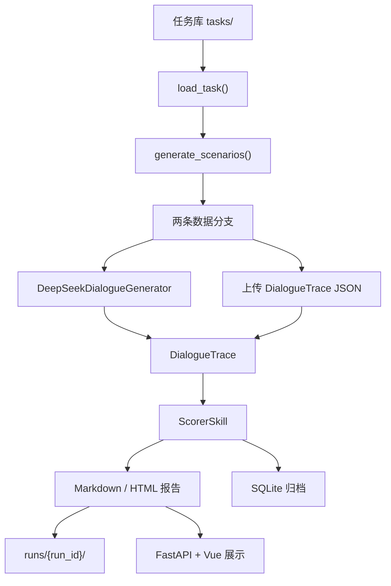

# 当前方案

## 目标

当前项目目标是交付一个可本地运行的网页评测工具，核心能力是：

```text
选择任务 -> 生成或导入对话 -> 评分 -> 生成网页报告
```

## 当前主流程



## 当前约束

- 运行链路统一走 DeepSeek / OpenAI-compatible 对话生成器
- 不再保留旧的 mock 执行分支作为正式运行入口
- 工具调用仍使用本地 MCP mock tools 产出可评分轨迹
- 报告命名采用“测评主题 + 日期编号”
- 统一任务库目录固定为 `tasks/`

## 当前交付重点

- 启动脚本可直接拉起网页
- 前端可选择任务库文件
- 前端可上传 `DialogueTrace JSON`
- 报告支持中文解释、分项汇总、可追溯证据
- 历史归档和报告分析接口可用
