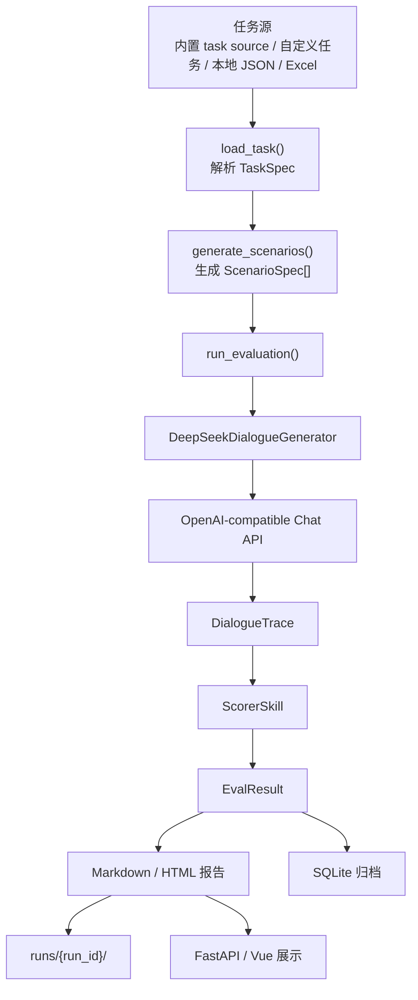

# 多轮外呼测评工具当前方案

## 1. 当前目标

项目当前目标是交付一个基于真实 DeepSeek 链路运行的本地评测工具：

`选择任务 -> 生成场景 -> 调模型生成完整对话 -> 评分 -> 生成网页报告`

## 2. 当前主流程

## 3. 当前约束

- 不再保留本地 mock 执行分支
- 工具层仍然使用本地 mock tools，便于稳定评测工具调用流程
- 报告命名使用“测评主题 + 日期 + 四位编号”
- 前端展示基于 `frontend/dist`
- 推荐启动方式是 `scripts/start-deepseek-web.cmd`

## 4. 当前交付重点

- 保证 `.env` 正确时可以直接启动网页
- 保证两个内置任务源可运行
- 保证报告中文正常显示
- 保证报告标题、分项汇总、证据明细符合当前实现
- 保证归档和历史查询可用
