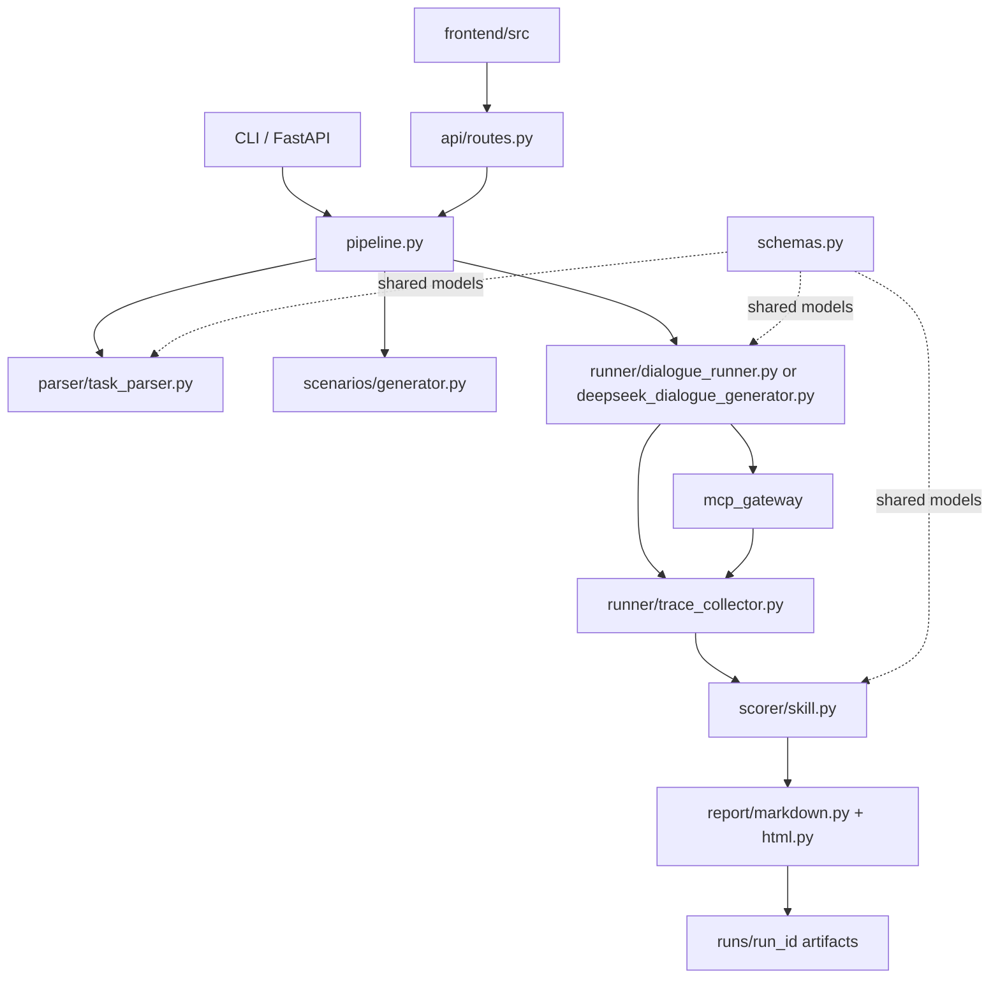

# Graphify Structural Report

Generated: 2026-05-26T23:07:44

Packet: repo-structure-packet
Primary mode: structural-fallback
Scope: project source, docs, examples, tests, scripts, and frontend source. Excluded .env, virtualenvs, caches, node_modules, dist, and historical run outputs.
Native Graphify: not used. This is a graphify-style structural fallback built from filesystem structure, Python imports, and explicit architecture edges.

## Summary

- Nodes: 97
- Edges: 246
- config: 1
- css: 1
- directory: 7
- file: 1
- html: 1
- json: 6
- markdown: 3
- package: 11
- python: 61
- typescript: 4
- vue: 1

## Architecture Flow

## Main Components

### dialogue_eval
Backend package root for CLI, API, pipeline, data models, runner, MCP gateway, scoring, reporting, and storage.
- `dialogue_eval/__init__.py`
- `dialogue_eval/cli.py`
- `dialogue_eval/config.py`
- `dialogue_eval/pipeline.py`
- `dialogue_eval/schemas.py`
- `dialogue_eval/task_sources.py`

### api
FastAPI entrypoints and report/static serving.
- `dialogue_eval/api/__init__.py`
- `dialogue_eval/api/app.py`
- `dialogue_eval/api/routes.py`

### parser
Task loading and Excel/JSON parsing into TaskSpec.
- `dialogue_eval/parser/__init__.py`
- `dialogue_eval/parser/excel_loader.py`
- `dialogue_eval/parser/json_loader.py`
- `dialogue_eval/parser/task_parser.py`

### scenarios
Scenario generation templates, including 15-user-scenario coverage.
- `dialogue_eval/scenarios/__init__.py`
- `dialogue_eval/scenarios/generator.py`
- `dialogue_eval/scenarios/templates.py`

### runner
Dialogue generation/execution and trace collection.
- `dialogue_eval/runner/__init__.py`
- `dialogue_eval/runner/deepseek_dialogue_generator.py`
- `dialogue_eval/runner/dialogue_runner.py`
- `dialogue_eval/runner/trace_collector.py`

### mcp_gateway
Mock MCP Tool Gateway and tool specs for objective tool trace scoring.
- `dialogue_eval/mcp_gateway/__init__.py`
- `dialogue_eval/mcp_gateway/gateway.py`
- `dialogue_eval/mcp_gateway/mock_tools.py`
- `dialogue_eval/mcp_gateway/tool_specs.py`

### scorer
Independent Scorer Skill: Outcome, Trace, Safety, Text scoring, aggregation.
- `dialogue_eval/scorer/__init__.py`
- `dialogue_eval/scorer/aggregate.py`
- `dialogue_eval/scorer/outcome.py`
- `dialogue_eval/scorer/rubrics.py`
- `dialogue_eval/scorer/safety.py`
- `dialogue_eval/scorer/skill.py`
- `dialogue_eval/scorer/text_judge.py`
- `dialogue_eval/scorer/trace.py`

### report
Markdown/HTML report rendering and analysis.
- `dialogue_eval/report/__init__.py`
- `dialogue_eval/report/analysis.py`
- `dialogue_eval/report/html.py`
- `dialogue_eval/report/markdown.py`

### storage
Run artifact persistence and optional archive helpers.
- `dialogue_eval/storage/__init__.py`
- `dialogue_eval/storage/archive.py`
- `dialogue_eval/storage/jsonl.py`
- `dialogue_eval/storage/run_store.py`

### frontend
Vue/Vite UI for running evaluations and viewing reports.
- `frontend/index.html`
- `frontend/package.json`
- `frontend/src/App.vue`
- `frontend/src/api/client.ts`
- `frontend/src/main.ts`
- `frontend/src/style.css`
- `frontend/src/vite-env.d.ts`
- `frontend/tsconfig.json`
- `frontend/vite.config.ts`

### docs
Architecture and engineering implementation specifications.
- `docs/dialogue-eval-plan.md`
- `docs/engineering-implementation-spec.md`

### examples
Demo task, scenarios, and trace data.
- `examples/dialogues/human_transfer_trace.json`
- `examples/scenarios/delivery_scenarios.json`
- `examples/tasks/course_live_task.json`
- `examples/tasks/fengmaotui_delivery_task.json`

### tests
Unit and smoke tests for parser, scenarios, MCP gateway, scorers, model selection, and leakage checks.
- `tests/test_course_no_delivery_leak.py`
- `tests/test_e2e_smoke.py`
- `tests/test_mcp_gateway.py`
- `tests/test_model_selection.py`
- `tests/test_scenario_generator.py`
- `tests/test_scorer_skill.py`
- `tests/test_task_parser.py`
- `tests/test_trace_scorer.py`

### scripts
Utility scripts and local uv wrappers.
- `scripts/import_excel_tasks.py`
- `scripts/read_docx_text.py`

## Key Files

- `dialogue_eval/pipeline.py` (functions: run_evaluation)
- `dialogue_eval/schemas.py` (classes: FlowStep, FAQItem, TaskConstraints, TaskSpec, ExpectedToolCall, ScenarioSpec)
- `dialogue_eval/cli.py` (functions: main, db_health, db_port, demo, run, score)
- `dialogue_eval/api/routes.py` (functions: health, database_health, task_sources, create_task, create_scenarios, create_eval_run, create_eval_run_stream, archive_runs)
- `dialogue_eval/runner/dialogue_runner.py` (classes: DialogueRunner; functions: run)
- `dialogue_eval/runner/deepseek_dialogue_generator.py` (classes: DeepSeekDialogueGenerator; functions: run)
- `dialogue_eval/mcp_gateway/gateway.py` (classes: MCPToolGateway; functions: list_tools, call_tool)
- `dialogue_eval/scorer/skill.py` (classes: ScorerSkill; functions: score)
- `dialogue_eval/report/markdown.py` (functions: render_markdown_report)
- `frontend/src/App.vue`
- `docs/dialogue-eval-plan.md`
- `docs/engineering-implementation-spec.md`

## Important Relationships

- `dialogue_eval/parser` --uses--> `dialogue_eval/schemas.py` - parsers create TaskSpec
- `dialogue_eval/scenarios` --uses--> `dialogue_eval/schemas.py` - scenario generator creates ScenarioSpec
- `dialogue_eval/runner` --calls--> `dialogue_eval/mcp_gateway` - runner invokes tools through gateway
- `dialogue_eval/runner` --feeds--> `dialogue_eval/scorer` - DialogueTrace is scored
- `dialogue_eval/scorer` --feeds--> `dialogue_eval/report` - EvalResult is rendered
- `dialogue_eval/api` --orchestrates--> `dialogue_eval/pipeline.py` - API starts evaluation pipeline
- `frontend/src/api/client.ts` --calls--> `dialogue_eval/api/routes.py` - frontend consumes FastAPI endpoints
- `docs/dialogue-eval-plan.md` --refines--> `docs/engineering-implementation-spec.md` - implementation spec operationalizes plan

## Suggested Next Graph Queries

1. Trace how an evaluation run flows from `api/routes.py` through `pipeline.py` into reports.
2. Inspect all imports into `dialogue_eval/schemas.py` to understand shared data model coupling.
3. Trace tool-call scoring from `mcp_gateway/gateway.py` to `scorer/trace.py` and `report/markdown.py`.
